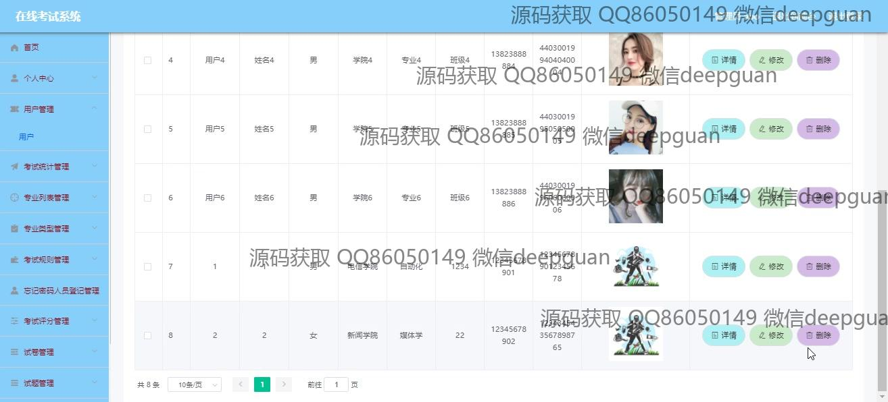

<h1 align="center">基于JavaWeb技术的在线考试系统设计与实现</h1>

## 简介
在线考试系统：角色分为管理员、用户；包括用户注册、个人信息管理、考试管理、题库和试卷管理、成绩记录和分析、多种考试资讯功能，界面简洁明了，便于操作与维护。    --计算机毕业设计源码；毕设源码；java毕业设计源码

## 联系方式

<h3 align="center">获取完整代码与数据库文件 + 微信：deepguan QQ: 86050149 QQ群: 783742310</h3>

<h3 align="center">可帮忙远程部署 包运行成功！提供远程部署、修改代码、设计文档指导、代码讲解等服务！</h3>

## 功能介绍（完整见运行截图）
管理员：管理员可以通过系统进行用户管理，包括查看、修改和删除用户信息。后台功能模块包括考试统计管理、考试试卷管理、专业列表管理、考试规则管理和考试积分管理等，确保考试内容和用户信息的高效管理。管理员能够在系统中录入考试评分，创建和编辑考试试题及试卷，查看考试统计和生成报告，以便于系统的整体运营和维护。此外，管理员具有添加和管理考试类别、专业信息以及导航菜单中的个性化选项，提升系统的灵活性与安全性。

用户：用户可以通过个人中心模块查看和编辑个人信息，包括学号、姓名、性别、学院、专业、班级、手机号等，以确保信息的准确性和完整性。用户可在系统中注册和登录，并获得对考试内容和资讯的访问权限。在考试模块中，用户可以查看考试规则、参加在线考试、获取考试成绩和查看考试错题记录等功能，帮助用户了解考试安排和知识掌握情况。同时，用户可上传头像图片和更新密码，确保账户的个性化管理与安全性。

考生：考生通过注册和登录功能获得系统的访问权限，并可在考试列表中查看考试安排和相关资讯。考生进入个人中心后，可以查看和编辑个人信息，包括上传头像和修改密码等功能，以保持信息的最新性。在参加考试时，考生能查看考试倒计时，提交答案并获得即时考试成绩反馈。通过错题本功能，考生能够分析过往考试的错误答案，提升自身学习效果与针对性复习。

系统：基于Spring Boot和JavaWeb技术的在线考试系统，提供了用户注册、个人信息管理、考试安排查看、在线考试与成绩反馈等功能模块。系统通过左侧的导航栏划分管理模块，包括用户管理、考试统计、考试试卷管理、专业课程管理等，支持管理员对考试内容和用户资料的高效管理。设计风格简洁，提供快速导航、信息录入和修改功能，以实现便捷的在线考试体验和高效的后台运营。

## 运行截图

本代码来源于网络,仅供学习参考使用!

